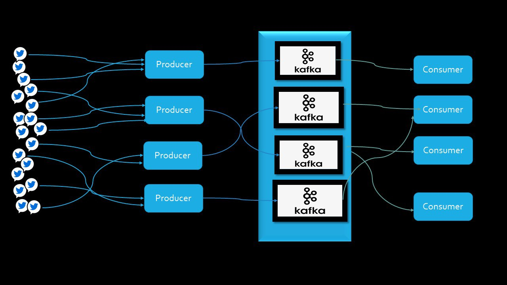

[![Contributors][contributors-shield]][contributors-url]
[![Forks][forks-shield]][forks-url]
[![Stargazers][stars-shield]][stars-url]
[![Issues][issues-shield]][issues-url]
[![MIT License][license-shield]][license-url]
[![LinkedIn][linkedin-shield]][linkedin-url]
<h1 align="center">Real-Time  Streaming Pipeline using </h1>
<h1 align="center">Kafka and Python</h1>

<p align="center">
   <a href="https://github.com/saboye/Real-Time-Streaming-Pipeline-using-Kafka-and-Python">
    
  </a>

### Overview 
A real-time streaming pipeline can stream live tweets from Twitter and ingest the data to the Apache Kafka clusters as a topic, and consumers consume the hashtag tweets as a message.

Create a developer account [here](https://developer.twitter.com/)  to get the Twitter API key. Then change the Twitter API key configuration at the virtual environment level by the newly generated API key.

```python
    export CONSUMER_KEY="XXXXXXXXXXXXXXXXXXXXXXXXX"
    export CONSUMER_SECRET="XXXXXXXXXXXXXXXXXXXXXX"
    export ACCESS_KEY="XXXXXXXXXXXXXXXXXXXXXXXXXXX"
    export ACCESS_SECRET="XXXXXXXXXXXXXXXXXXXXXXXX"
```
#### Install

```python
    git clone https://github.com/saboye/Real-Time-Streaming-Pipeline-using-Kafka-and-Python.

    pip install -r requirements.txt
 
```
#### Kafka configuration

```python
    advertised.listeners=PLAINTEXT://localhost:9092
    zookeeper.connect=localhost:2181 

````

#### To run locally you need to installed [Apache Kafka](https://kafka.apache.org/downloads) 
#### 1. run the zookeeper the next command: 

```python

    bin/zookeeper-server-start.sh config/zookeeper.properties 

```

#### 2. To run the Kafka use the following command: 

```python
    JMX_PORT=8004 bin/kafka-server-start.sh config/server.properties

```

#### 3. run the producer Notebook. 


#### 4. run the Consumer Notebook. 


#### Author

👤 **SABOYE**

* Twitter: [@saboye1](https://twitter.com/saboye1)
* Github: [@saboye](https://github.com/saboye)


#### 🤝 Contributing

Contributions, issues and feature requests are welcome!<br />Feel free to check [issues page](https://github.com/saboye/Real-Time-Streaming-Pipeline-using-Kafka-and-Python/issues).

#### Show your support

Give a ⭐️ if this project helped you!

#### 📝 License


This project is [MIT](https://github.com/saboye/Real-Time-Streaming-Pipeline-using-Kafka-and-Python/blob/main/LICENSE) licensed.

***

[contributors-shield]: https://img.shields.io/github/contributors/saboye/Real-Time-Streaming-Pipeline-using-Kafka-and-Python?style=for-the-badge
[contributors-url]: https://github.com/saboye/Automated-File-Transfer-with-Bash/graphs/contributors
[forks-shield]: https://img.shields.io/github/stars/saboye/Real-Time-Streaming-Pipeline-using-Kafka-and-Python?style=for-the-badge
[forks-url]: https://github.com/saboye/Real-Time-Streaming-Pipeline-using-Kafka-and-Python/network/members
[stars-shield]: https://img.shields.io/github/stars/saboye/Real-Time-Streaming-Pipeline-using-Kafka-and-Python?style=for-the-badge
[stars-url]: https://github.com/saboye/Automated-File-Transfer-with-Bash/stargazers
[issues-shield]: https://img.shields.io/github/issues/saboye/Real-Time-Streaming-Pipeline-using-Kafka-and-Python?style=for-the-badge
[issues-url]: https://github.com/saboye/Real-Time-Streaming-Pipeline-using-Kafka-and-Python/issues
[license-shield]: https://img.shields.io/github/license/saboye/Real-Time-Streaming-Pipeline-using-Kafka-and-Python?style=for-the-badge
[license-url]: https://github.com/saboye/Real-Time-Streaming-Pipeline-using-Kafka-and-Python/blob/master/LICENSE.txt
[linkedin-shield]: https://img.shields.io/badge/-LinkedIn-black.svg?style=for-the-badge&logo=linkedin&colorB=555
[linkedin-url]: https://linkedin.com/in/samuelaboye


